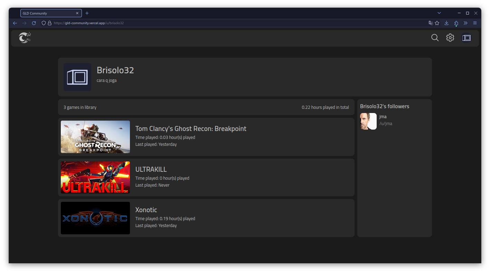
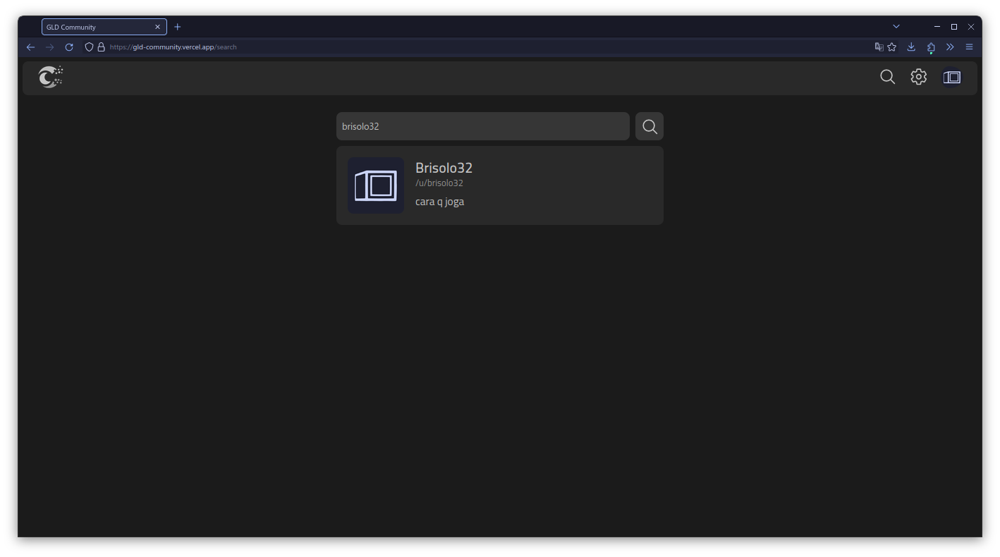
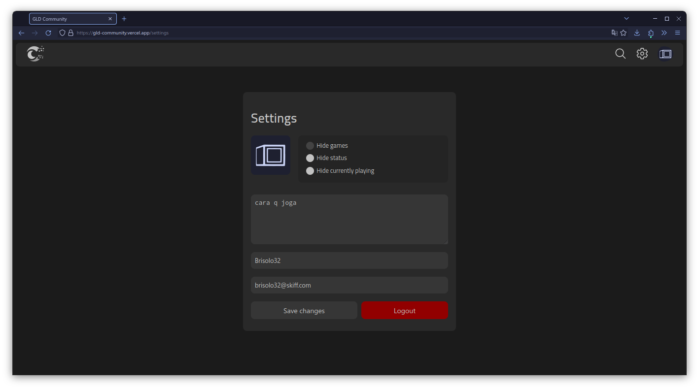

# GLD-Comm Readme

## Overview

Welcome to GLD-Comm, a web application designed to track and manage information related to Project GLD, a game launcher. GLD-Comm provides a centralized platform for users to keep tabs on games, playtime, profile pictures (pfps), and settings associated with their Project GLD experience.

## Pictures




## Features

- **Game Tracking:** Keep a record of the games you play through Project GLD, including playtime and other relevant details.

- **Profile Pictures (PFPs):** Manage and showcase your profile pictures associated with Project GLD.

- **Settings:** Store and customize your Project GLD settings for a personalized gaming experience.

## Getting Started

Follow these steps to get started with GLD-Comm:

1. **Clone the Repository:**
   ```bash
   git clone https://github.com/Brisolo32/gld-comm.git
   ```
2. Install Dependencies:

    ```bash
    cd gld-comm
    bun install # gld-comm uses bun but you can also use npm
    ```

3. Configuration:

    Open the .env file and provide the required configurations, including the Pocketbase backend details.

4. Run the Application:

    ```bash
    bun start
    ```

5. Access the Application:
    Open your web browser and navigate to http://localhost:5173 to access GLD-Comm.

## Backend Integration

GLD-Comm utilizes Pocketbase as the backend. Ensure that you have a instance running and configure the backend details in the `src/scripts/Pocketbase.ts` file.

## Contributing

I welcome contributions to enhance GLD-Comm. If you have ideas, bug reports, or want to contribute code, please open up a PR, I'd gladly accept it

If you encounter any issues or have questions, please open an issue on the repo.

---
GLD-Comm is released under the [MIT License](https://mit-license.org/).